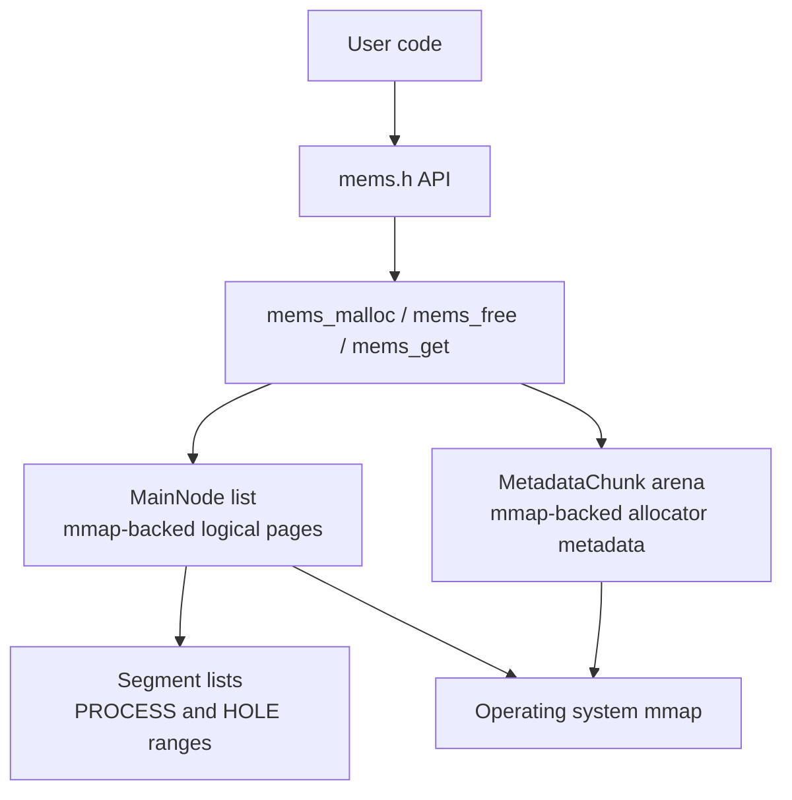
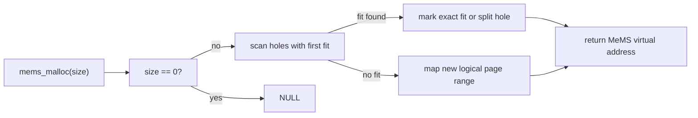

# MeMS Custom Memory Manager

MeMS is a compact C implementation of a simulated virtual memory manager. It
returns deterministic MeMS virtual addresses that begin at `1000`, backs storage
with `mmap`, tracks free and used ranges in linked-list metadata, and translates
MeMS addresses back to real process pointers with `mems_get`.

The project is intentionally small, but it is structured like a reusable
library: allocator implementation, public header, demo executable, and focused
tests.

## What It Does

| Capability | Behavior |
| --- | --- |
| Simulated virtual addresses | `mems_malloc` returns logical addresses such as `1000`, `2000`, and so on. |
| Physical backing | Data lives in anonymous private `mmap` regions. |
| Logical pages | Allocation regions are rounded to `PAGE_SIZE` logical pages. The default is `4096`. |
| First-fit reuse | Freed holes are reused before new regions are mapped. |
| Splitting | Allocating from a larger hole splits the remaining range into a new hole. |
| Coalescing | Adjacent free ranges are merged when memory is freed. |
| Interior translation | `mems_get` accepts any address inside an allocated process segment. |
| Safe invalid frees | `mems_free` ignores null, unknown, already-free, and interior pointers. |
| Metadata arena | Internal metadata is also allocated with `mmap`; the allocator does not call `malloc` or `free`. |

## Repository Layout

| Path | Purpose |
| --- | --- |
| `mems.h` | Public API and logical page-size configuration. |
| `mems.c` | Allocator implementation and internal metadata management. |
| `main.c` | Demo program that exercises allocation, translation, frees, and stats. |
| `test_mems.c` | Assertion-based regression tests for critical allocator behavior. |
| `Makefile` | Build, test, sanitizer, and cleanup commands. |

## Architecture



### Data Model

MeMS keeps two layers of state:

| Structure | Responsibility |
| --- | --- |
| `MainNode` | Owns one mapped backing region, its MeMS virtual base, logical size, mapped size, and sub-chain of segments. |
| `Segment` | Describes a contiguous range inside a `MainNode` as either `PROCESS` or `HOLE`. |
| `MetadataChunk` | Provides bump-allocated storage for internal `MainNode` and `Segment` records. |

Each `MainNode` represents a logical page-aligned virtual range. Its `segments`
list partitions that range into allocated process segments and reusable holes.

### Allocation Flow



### Free Flow

`mems_free` only frees the exact start address of a live process segment. This
matches allocator-style ownership rules and prevents accidental interior-pointer
frees from corrupting the segment list. After marking a segment as a hole, MeMS
coalesces with adjacent holes.

### Translation Flow

`mems_get(v_ptr)`:

1. Finds the `MainNode` whose virtual range contains `v_ptr`.
2. Finds the segment whose range contains the offset.
3. Returns `NULL` unless the segment is a live `PROCESS`.
4. Returns `physical_base + offset` for valid live allocations.

## Requirements

- C11 compiler such as `cc`, `clang`, or `gcc`
- POSIX-like environment with `mmap`, `munmap`, and `sysconf`
- `make`

The project has no third-party dependencies.

## Build

```sh
make
```

This builds the demo executable:

```sh
./mems_demo
```

You can also build it explicitly:

```sh
make demo
```

## Test

Run the normal regression suite:

```sh
make test
```

Run with AddressSanitizer and UndefinedBehaviorSanitizer:

```sh
make sanitize
```

Clean generated binaries:

```sh
make clean
```

## API

```c
void mems_init(void);
void mems_finish(void);
void *mems_malloc(size_t size);
void mems_free(void *v_ptr);
void *mems_get(void *v_ptr);
void mems_print_stats(void);
```

### `mems_init`

Initializes allocator state. Calling it again resets existing MeMS state by
first calling `mems_finish`.

```c
mems_init();
```

The allocator also initializes itself lazily if `mems_malloc`, `mems_get`,
`mems_free`, or `mems_print_stats` is called first.

### `mems_malloc`

Allocates `size` bytes and returns a simulated MeMS virtual address.

```c
void *v = mems_malloc(128);
```

Important rules:

- Returns `NULL` for `size == 0`.
- Reuses the first sufficiently large hole when possible.
- Maps a new logical page range when no existing hole can satisfy the request.
- The returned value must not be dereferenced directly.

### `mems_get`

Translates a live MeMS virtual address to a real process pointer.

```c
char *physical = mems_get(v);
if (physical != NULL) {
    physical[0] = 'A';
}
```

`mems_get` returns `NULL` when the address is outside MeMS, inside a hole, or
past the end of an allocated segment.

### `mems_free`

Frees a live process segment by its exact starting MeMS virtual address.

```c
mems_free(v);
```

Invalid frees are ignored, including `NULL`, unknown addresses, interior
addresses, and addresses that already refer to holes.

### `mems_print_stats`

Prints the current allocator chain:

```c
mems_print_stats();
```

The output includes:

- Main-chain virtual ranges
- Process and hole sub-ranges
- Logical pages used
- Unused bytes inside holes
- Main-chain length
- Sub-chain length per main node

### `mems_finish`

Unmaps all backing regions and metadata chunks, then resets global state.

```c
mems_finish();
```

It is safe to call more than once.

## Example

```c
#include "mems.h"

#include <stdio.h>

int main(void)
{
    void *v_addr;
    int *physical;

    mems_init();

    v_addr = mems_malloc(sizeof(int));
    physical = mems_get(v_addr);

    if (physical != NULL) {
        *physical = 42;
        printf("%d\n", *physical);
    }

    mems_free(v_addr);
    mems_finish();
    return 0;
}
```

Compile with:

```sh
cc -std=c11 -Wall -Wextra -Werror -pedantic example.c mems.c -o example
```

## Configuration

`PAGE_SIZE` controls the logical page size used by MeMS output and allocation
rounding. It defaults to `4096`.

Override it at compile time:

```sh
cc -DPAGE_SIZE=8192 -std=c11 -Wall -Wextra -Werror -pedantic main.c mems.c -o mems_demo
```

`PAGE_SIZE` must be greater than zero. The implementation still rounds actual
`mmap` calls to the host OS page size when required.

## Testing Coverage

The regression suite covers:

- Lazy initialization
- Zero-byte allocation rejection
- Virtual-to-physical translation
- Interior-address translation within live allocations
- Out-of-range translation rejection
- First-fit hole reuse
- Hole splitting
- Exact-fit reuse
- Adjacent-hole coalescing
- Invalid and interior frees
- Large allocations spanning multiple logical pages
- Repeated `mems_finish` safety
- Lifecycle reset back to virtual address `1000`
- Stats printing smoke coverage

## Troubleshooting

| Symptom | Likely Cause | Fix |
| --- | --- | --- |
| Segmentation fault after `mems_malloc` | The MeMS virtual address was dereferenced directly. | Call `mems_get` and use the returned physical pointer. |
| `mems_get` returns `NULL` | Address is invalid, freed, outside the allocation, or in a hole. | Keep the original allocation start and check bounds. |
| `mems_free` appears to do nothing | The pointer is not the exact start of a live segment. | Free only the value returned by `mems_malloc`. |
| Sanitizer target fails to link | Compiler does not support the configured sanitizer flags. | Use Clang or GCC with AddressSanitizer and UBSan support. |

## Current Validation

The repository has been validated with:

```sh
make test
make sanitize
make demo && ./mems_demo
```

All three commands completed successfully on macOS with Apple Clang 17.
